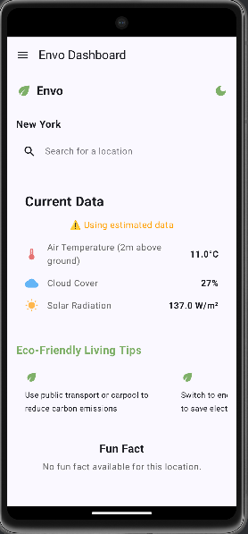
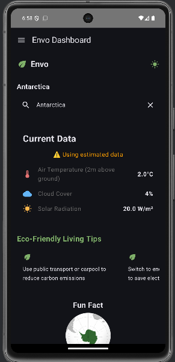
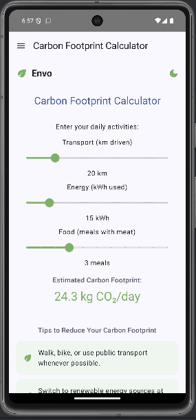
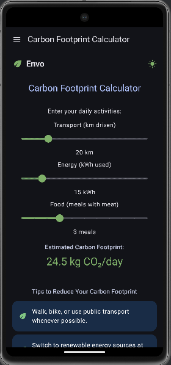
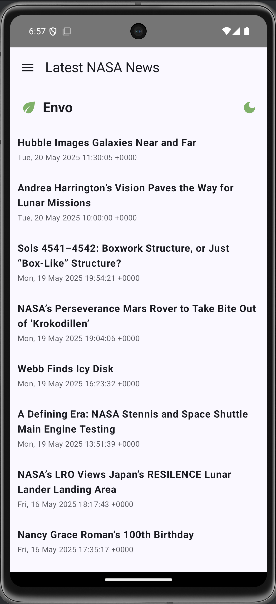
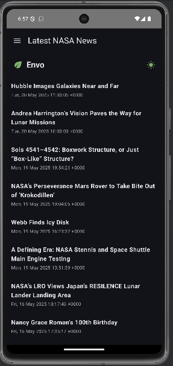

# 🌿 Envo – Environmental Data & Carbon Footprint Tracker

**Envo** is a Kotlin-based Android app that allows users to explore live environmental data (like temperature, cloud cover, and solar radiation) and estimate their daily **carbon footprint** based on lifestyle habits.

## 📱 Key Features

- 🌡️ **Live Environmental Data**
  - Fetches Land Surface Temperature (2m above ground), Cloud Cover, and Solar Radiation
  - Powered by the [NASA POWER API](https://power.larc.nasa.gov/)

- 🌍 **Carbon Footprint Calculator**
  - Inputs: transport (km), energy (kWh), and food (meals with meat)
  - Calculates CO₂ emissions using realistic emission factors:
    - 🚗 Transport: `0.2 kg CO₂/km`
    - 🔌 Energy: `0.8 kg CO₂/kWh`
    - 🍗 Food: `2.5 kg CO₂/meal`

- 🔍 **Search by Location**
  - View environmental data based on user input or device location

- 🧪 Designed with Jetpack Compose
  - Smooth UI experience and dynamic data rendering

## 🛠 Tech Stack

- **Kotlin**
- **Jetpack Compose**
- **NASA POWER API**
- **Wikipedia data sources (optional)**
- **MVVM Architecture**
- **Cursor for UI prompts (optional)**

## 🖼️ Screenshots – Light & Dark Mode Side by Side

### 🔹 Home Screen
<table>
  <tr>
    <td><strong>Light Mode</strong></td>
    <td><strong>Dark Mode</strong></td>
  </tr>
  <tr>
    <td></td>
    <td></td>
  </tr>
</table>

### 🔹 Carbon Footprint Screen
<table>
  <tr>
    <td><strong>Light Mode</strong></td>
    <td><strong>Dark Mode</strong></td>
  </tr>
  <tr>
    <td></td>
    <td></td>
  </tr>
</table>

### 🔹 Latest NASA News
<table>
  <tr>
    <td><strong>Light Mode</strong></td>
    <td><strong>Dark Mode</strong></td>
  </tr>
  <tr>
    <td></td>
    <td></td>
  </tr>
</table>


## 🚀 Getting Started

1. Clone this repository:

```bash
git clone https://github.com/YashBhadange2006/Envo.git
